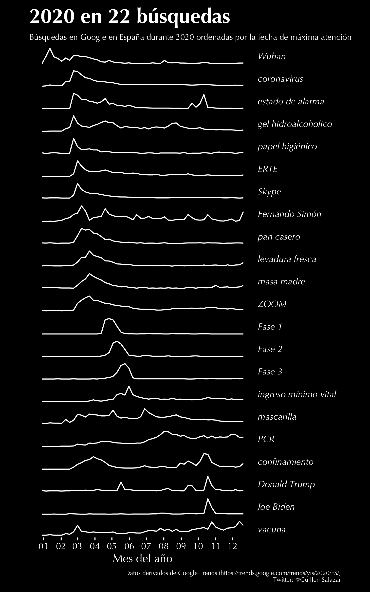

Plotting the interest over time of terms identified as trending in 2020 by Google Trends. Code available [here](https://github.com/GuillemSalazar/r_miscellanea/blob/gh-pages/code/google_trends_2020.R).



### How to:

Google Trends identifies search terms being trendy during a specific year and by country, for example [the trending search terms in Spain during 2020](https://trends.google.com/trends/yis/2020/ES/). These lists are based on search terms that had the highest spike a specific year when compared to the previous year. Google Trends queries can be accessed with R by using the [gtrendsR package](https://cran.r-project.org/web/packages/gtrendsR/), through which the number of hits for a given term in Google Trends data can be accessed.

Here I selected a set of 22 terms identified as trendy in 2020 in Spain ([see here](https://trends.google.com/trends/yis/2020/ES/)) and retrieved their interest over time through the **gtrendsR* package. The main function used here is the one performing a Google Trends query:

```{R}
library(gtrendsR)
gtrends(keyword = "Wuhan",geo = "ES",time = "today 12-m",gprop = "web",onlyInterest = T)
```

I used it to iteratively search all the 22 terms and plot their interest over time during 2020. Some extra code was used so the terms are ordered by date of peak query. A nice stratification of COVID-related terms arise through time. You can check the entire code [here](https://github.com/GuillemSalazar/r_miscellanea/blob/gh-pages/code/google_trends_2020.R).